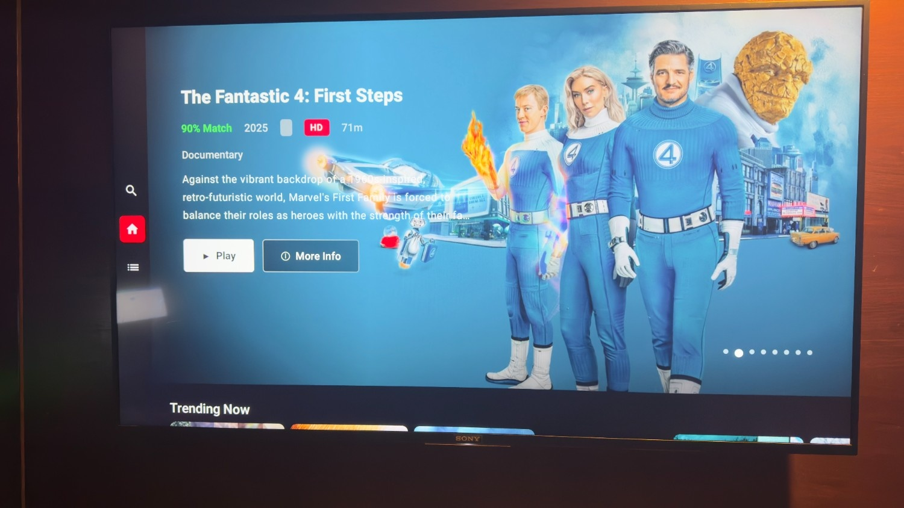
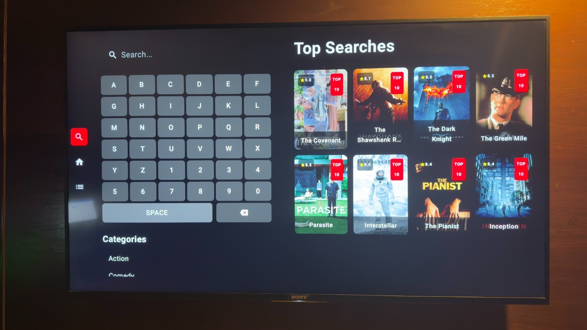
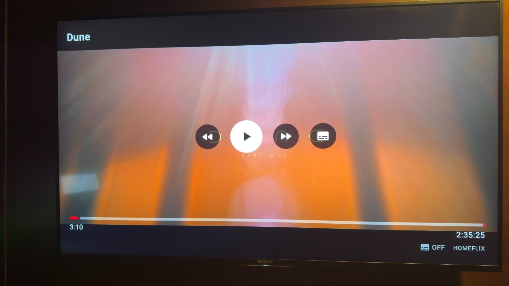
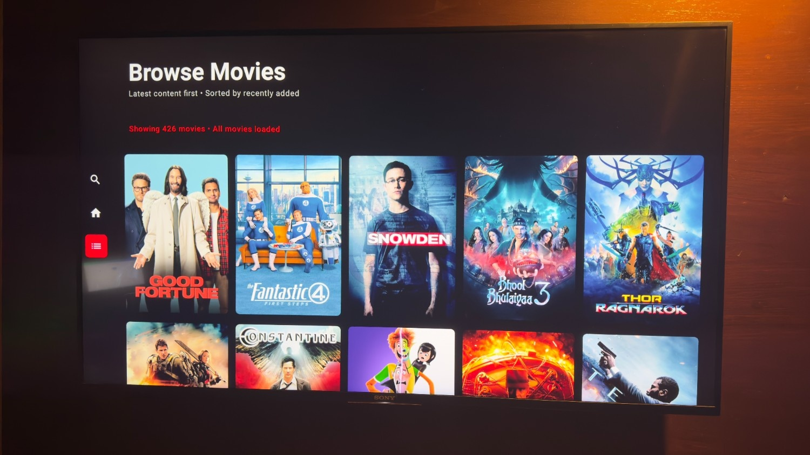

# 🎬 HomeFlix TV - Netflix-Style Android TV App
A premium Android TV streaming application with Netflix-level UI/UX, featuring ultra-fast LAN streaming, smooth D-pad navigation, and professional-grade video playback. Built with Jetpack Compose and optimized for the big screen experience.

    

## 📱 App Screenshots

### Home Screen & Search
| Home Screen | Search Screen |
|-------------|---------------|
|  |  |

### Video Player & Browse
| Video Player | Browse Screen |
|--------------|---------------|
|  |  |

### 🎯 Netflix-Level Features
- **Auto-sliding hero section** with fade animations
- **Smooth D-pad navigation** optimized for TV remotes  
- **Focus management** with visual feedback
- **Continue watching** functionality
- **Professional video player** with subtitle support
- **Clean, modern UI** following Material Design 3

## 🌟 HomeFlix Ecosystem

HomeFlix TV is part of the comprehensive **HomeFlix streaming platform ecosystem**:

- **🏠 HomeFlix Web Backend** - Full-featured media server with torrent downloads
- **📱 HomeFlix TV** - Android TV client (this repository)  
- **🌐 Web Interface** - Netflix-style web UI for browser access

🔗 **Backend Repository**: [HomeFlix Web App](https://github.com/azad25/homeflix-wifi)

### 🎥 Complete Streaming Solution
The HomeFlix ecosystem provides a professional streaming experience with:
- **One-click torrent downloads** directly from TMDB movie pages
- **Real-time download progress** tracking with speed and ETA
- **Automatic library integration** for downloaded content
- **Multi-source torrent search** with quality filtering (4K, 1080p, 720p)
- **Smart media management** with automatic metadata fetching
- **Netflix-style interface** across all platforms
- **Cross-platform compatibility** (Web, Android TV, Mobile)

## ✨ Features

### 🎥 Advanced Video Streaming
- **Ultra-fast LAN streaming** with instant playback
- **ExoPlayer integration** with professional-grade video rendering
- **Multiple format support** (MP4, MKV, AVI, MOV, WMV)
- **Adaptive streaming** with automatic quality adjustment
- **Resume playback** from last watched position
- **Enhanced subtitle support** with customizable styling
- **Progress tracking** with automatic save on exit
- **Netflix-red themed player** with smooth controls

### 📺 Netflix-Style TV Interface
- **Auto-sliding hero section** with fade in/out animations
- **Staggered content animations** for professional polish
- **Smooth D-pad navigation** between all UI elements
- **48dp side navigation** with focus indicators
- **Continue Watching** row for seamless resumption
- **Multiple content rows** (Trending, Popular, Recently Added)
- **Genre-based browsing** with clean card layouts
- **Search functionality** with virtual keyboard

### 🎮 TV Remote Optimization
- **Natural D-pad navigation** following Android TV guidelines
- **Focus management** with clear visual feedback
- **LEFT arrow** navigates to sidebar from any screen
- **BACK button** focuses navigation (Netflix behavior)
- **UP/DOWN arrows** for smooth content scrolling
- **No focus traps** - can navigate freely between areas
- **Auto-focus** on first content row at app launch

### 🏗️ Technical Architecture
- **Clean Architecture** with MVVM pattern and separation of concerns
- **Jetpack Compose** for modern declarative UI with Material Design 3
- **Hilt dependency injection** for maintainable and testable code
- **ExoPlayer 3** integration for professional video playback
- **Coroutines and Flow** for reactive programming and async operations
- **Navigation Component** with type-safe screen routing
- **StateFlow** for reactive UI state management
- **Coil** for efficient image loading and caching
- **Retrofit** for REST API communication

## 🚀 Quick Start

### Prerequisites
- Android Studio Arctic Fox or later
- Android TV device or emulator (API 23+)
- **HomeFlix media server** running on your network
- HomeFlix backend setup from [HomeFlix Web App](https://github.com/azad25/homeflix-wifi)

### Installation

1. **Set up HomeFlix Backend**
   - Install and configure [HomeFlix Web App](https://github.com/azad25/homeflix-wifi)
   - Ensure your media server is running and accessible
   - Configure torrent download settings if desired

2. **Clone the TV client repository**
   ```bash
   git clone https://github.com/your-username/HomeFlixTV.git
   cd HomeFlixTV
   ```

3. **Configure backend connection**
   
   Update the base URL in `VideoPlayer.kt`:
   ```kotlin
   private fun getBaseUrl(): String {
       return "http://YOUR_SERVER_IP:8252"  // Replace with your server IP
   }
   ```
   
   Or update the API configuration in your network module for global configuration.

4. **Build and run**
   ```bash
   ./gradlew assembleDebug
   ```

   Or open in Android Studio and click **Run** ▶️

## 🏗️ Architecture Overview

### Package Structure
```
com.homeflix.tv/
├── HomeFlixTVApplication.kt     # Application class with Hilt setup
├── di/                          # Dependency injection modules
│   └── NetworkModule.kt        # Retrofit and API configuration
├── domain/                      # Business logic and models
│   └── model/
│       ├── Media.kt            # Core media data model
│       ├── Genre.kt            # Genre classification
│       ├── ContinueWatching.kt # Playback progress tracking
│       └── MediaType.kt        # Movie/TV show enumeration
├── data/                        # Data access layer
│   ├── remote/api/             # API service interfaces
│   ├── remote/dto/             # Data transfer objects
│   └── repository/              # Repository implementations
├── presentation/                # UI layer (Jetpack Compose)
│   ├── MainActivity.kt         # Main TV activity
│   ├── navigation/             # Navigation graph and routes
│   ├── screens/                # Screen composables
│   │   ├── home/               # Home screen with hero section
│   │   ├── search/             # Search with virtual keyboard
│   │   ├── browse/             # Browse movies grid
│   │   ├── details/            # Movie details screen
│   │   └── player/             # Video player screen
│   ├── components/             # Reusable UI components
│   │   ├── NetflixHeroSection.kt    # Auto-sliding hero carousel
│   │   ├── NetflixSideNavigation.kt # 48dp sidebar navigation
│   │   ├── NetflixMediaCard.kt      # Focusable movie cards
│   │   ├── MediaRow.kt              # Horizontal content rows
│   │   └── VideoPlayer.kt           # ExoPlayer integration
│   └── theme/                  # Material Design 3 theming
└── util/                       # Utility classes and helpers
    └── ApiUtils.kt             # URL construction helpers
```

### Key Components

#### Video Player (`VideoPlayer.kt`)
- **Professional ExoPlayer integration** with custom controls
- **Netflix-style UI** with red accent colors and smooth animations
- **TV remote optimization** with D-pad navigation support
- **Auto-hiding controls** after 3 seconds of inactivity
- **Progress tracking** with automatic save on player exit
- **Enhanced subtitle support** with customizable text size and transparent background
- **Multiple playback speeds** and seeking controls
- **Volume control** with visual feedback

#### Hero Section (`NetflixHeroSection.kt`)
- **Auto-sliding carousel** with 5-second intervals
- **Staggered animations** for title, metadata, description, and buttons
- **Loading states** with Netflix-red spinner and fade transitions
- **Background crossfade** between different media items
- **Netflix-style metadata** with match percentage, year, rating, and genres
- **Responsive layout** optimized for 480dp height
- **Focus management** without blocking D-pad navigation

#### Side Navigation (`NetflixSideNavigation.kt`)
- **48dp wide icon-only sidebar** for clean TV interface
- **Individual focusable icons** with proper focus management
- **Netflix red selection** indicator for current page
- **White border focus** indicators with smooth transitions
- **Passive focus behavior** - only gets focus when explicitly requested
- **RIGHT arrow exit** back to content areas

#### Media Cards (`NetflixMediaCard.kt`)
- **Netflix-style scaling** animation on focus (1.05x scale)
- **White border indicators** with 3dp width for clear focus feedback
- **Smooth transitions** with 200ms animation timing
- **Aspect ratio optimization** (2:3) for poster display
- **Elevation changes** on focus for depth perception
- **Click handling** with proper navigation to details screens

## 🎮 Navigation System

### Netflix-Level D-Pad Navigation
The app implements a sophisticated navigation system that matches Netflix's TV app behavior:

```
App Launch Flow:
├── Focus: First content row (Continue Watching/Trending)
├── UP arrow: Navigate to hero section
├── DOWN arrow: Navigate between content rows
├── LEFT arrow: Navigate to sidebar from any screen
├── RIGHT arrow: Navigate back to content from sidebar
└── BACK button: Focus navigation (Netflix behavior)

Content Navigation:
├── Individual cards: Independently focusable with scaling animation
├── Smooth scrolling: Auto-scroll to focused items in rows
├── Visual feedback: White borders and scaling on focus
├── No focus traps: Can navigate freely between all areas
└── Natural traversal: System handles focus movement between elements
```

### Screen-Specific Features
- **Home Screen**: Auto-sliding hero, multiple content rows, continue watching
- **Search Screen**: Virtual keyboard, genre browsing, search results grid
- **Browse Screen**: Paginated movie grid with load more functionality
- **Details Screen**: Full movie information with play/info buttons
- **Video Player**: Custom controls with subtitle support and progress tracking

## 🎨 UI/UX Design

### Netflix-Inspired Interface
- **Material Design 3** with dark theme optimized for TV viewing
- **Netflix color scheme** with red accents (#E50914) and white text
- **Staggered animations** for professional content entrance
- **Smooth transitions** between all screens and states
- **Consistent focus indicators** across all interactive elements

### TV-Specific Optimizations
- **Landscape-only orientation** for TV viewing
- **48dp sidebar navigation** for easy thumb navigation
- **Large card layouts** (160dp width) optimized for viewing distance
- **High contrast colors** for visibility in various lighting conditions
- **Smooth scaling animations** for focus feedback

## 🔧 Configuration

### Backend Integration
HomeFlix TV connects to the HomeFlix web backend which provides:
- **Media library management** with automatic metadata fetching
- **Torrent download system** with real-time progress tracking
- **Multi-source search** through Jackett integration
- **Quality filtering** (4K, 1080p, 720p, 480p)
- **Automatic transcoding** for unsupported formats
- **Subtitle management** and streaming

### Network Configuration
```
Default Port: 8252
Protocol: HTTP (LAN only)
Streaming: HLS/DASH support
Transcoding: On-demand for unsupported formats
Torrent Integration: Jackett with 600+ sources
```

### Supported Media Formats
- **Video**: MP4, MKV, AVI, MOV, WMV
- **Audio**: AAC, MP3, AC3, DTS, ALAC (lossless)
- **Subtitles**: SRT, VTT, ASS/SSA
- **Codecs**: H.264, H.265/HEVC, VP9
- **Containers**: Support for all major formats with automatic transcoding

## 📱 Development

### Building from Source
```bash
# Debug build
./gradlew assembleDebug

# Release build
./gradlew assembleRelease

# Run tests
./gradlew test

# Generate APK
./gradlew bundleDebug
```

### Code Style
- Follows [Kotlin Coding Conventions](https://kotlinlang.org/docs/coding-conventions.html)
- Uses [Detekt](https://detekt.github.io/detekt/) for static analysis
- Implements [Clean Architecture](https://blog.cleancoder.com/uncle-bob/2012/08/13/the-clean-architecture.html) principles

### Testing
- Unit tests for ViewModels and repositories
- UI tests for critical user flows
- Integration tests for API communication

## 🚀 Current Development Status

### ✅ Completed Features
- **Netflix-style UI/UX** with Material Design 3
- **Smooth D-pad navigation** optimized for TV remotes
- **Auto-sliding hero section** with fade animations
- **Professional video player** with ExoPlayer integration
- **Enhanced subtitle support** with customizable styling
- **Focus management system** following Android TV guidelines
- **Multiple screen navigation** (Home, Search, Browse, Details, Player)
- **Progress tracking** with resume functionality
- **Search functionality** with virtual keyboard
- **Genre-based browsing** with paginated results

### 🔄 In Progress
- Backend integration improvements
- Additional streaming format support
- Performance optimizations
- Enhanced error handling

### 📋 Planned Features
- Watchlist functionality
- User profiles and preferences
- Advanced search filters
- Offline download support
- Cast integration

## 🐛 Troubleshooting

### Navigation Issues
- **Focus stuck**: Press BACK button to reset focus to navigation
- **Can't navigate**: Ensure D-pad is working, try LEFT arrow to access sidebar
- **Scroll issues**: Use UP/DOWN arrows, avoid using trackpad/mouse

### Video Playback Issues
- **No video**: Check server IP configuration in `getBaseUrl()` function
- **Buffering**: Verify network connection and server performance
- **Subtitles**: Press 'S' key or use subtitle button in player controls
- **Audio issues**: Check volume settings and audio codec compatibility

### Build Issues
- **Compilation errors**: Update Android Studio and sync Gradle
- **Dependencies**: Run `./gradlew clean build` to refresh dependencies
- **Focus issues**: Ensure target SDK is set to Android TV (API 23+)

## ©️ Copyright

**© 2025 Homeflix Studios. All Rights Reserved.**

Homeflix Studios is the creator and maintainer of the HomeFlix streaming platform ecosystem, including the HomeFlix web backend and Android TV applications.

## 🙏 Acknowledgments

- **ExoPlayer** team for professional-grade media playback library
- **Jetpack Compose** team for modern declarative UI toolkit
- **Android TV** team for TV platform guidelines and support
- **Material Design** team for comprehensive design system
- **Hilt** team for dependency injection framework
- **Coil** team for efficient image loading library
- **Netflix** for UI/UX inspiration and TV navigation patterns
- **HomeFlix** ecosystem for streaming backend integration

## 📞 Support

For issues, questions, or contributions:
- Open an issue on GitHub
- Check existing documentation
- Review troubleshooting section

🔗 **Backend Support**: [HomeFlix Web App Issues](https://github.com/azad25/homeflix-wifi/issues)

---