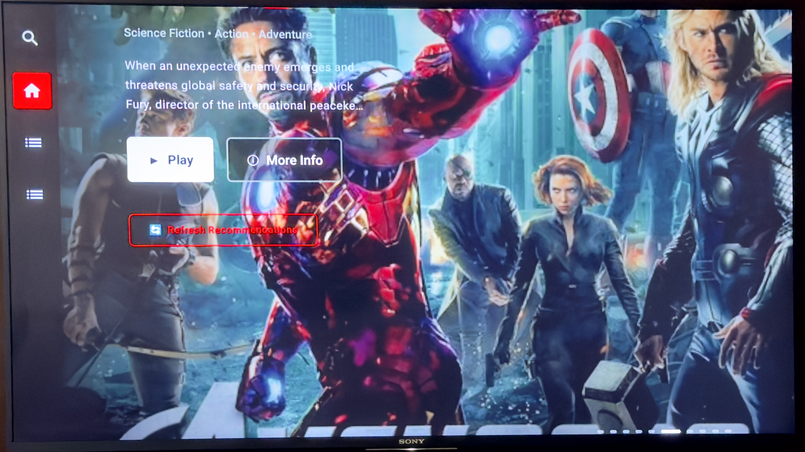

# 🎬 HomeFlix TV app from HomeFlix Studios
A smart TV streaming application built specifically for Android TV, featuring ultra-fast LAN streaming capabilities and a modern Jetpack Compose UI. Designed to work seamlessly with HomeFlix media server backends.

  



## 🌟 HomeFlix Ecosystem

HomeFlix TV is part of the comprehensive **HomeFlix streaming platform ecosystem**:

- **🏠 HomeFlix Web Backend** - Full-featured media server with torrent downloads
- **📱 HomeFlix TV** - Android TV client (this repository)  
- **🌐 Web Interface** - Netflix-style web UI for browser access

🔗 **Backend Repository**: [HomeFlix Web App](https://github.com/azad25/homeflix-wifi)

### 🎥 Complete Streaming Solution
The HomeFlix ecosystem provides a professional streaming experience with:
- **One-click torrent downloads** directly from TMDB movie pages
- **Real-time download progress** tracking with speed and ETA
- **Automatic library integration** for downloaded content
- **Multi-source torrent search** with quality filtering (4K, 1080p, 720p)
- **Smart media management** with automatic metadata fetching
- **Netflix-style interface** across all platforms
- **Cross-platform compatibility** (Web, Android TV, Mobile)

## ✨ Features

### 🎥 Streaming Capabilities
- **Ultra-instant LAN streaming** with sub-millisecond response times
- **Zero-copy sendfile streaming** for instant playback
- **Multi-tier caching system** (L1/L2/L3) for optimal performance
- **Netflix-level buffer management** for smooth playback
- **Gigabit LAN optimization** for home media servers
- **Instant MKV transcoding and caching**
- **Resume playback** from last position
- **Subtitle support** with multiple language tracks

### 📺 TV-Optimized Interface
- **Netflix-inspired UI** with hero sections and horizontal content rows
- **D-pad navigation** optimized for TV remotes
- **Focus management** with smooth animations
- **60dp side navigation** for consistent TV experience
- **Auto-sliding hero section** every 10 seconds
- **Continue watching** row for resuming content
- **Large card layouts** optimized for TV viewing distance

### 🏗️ Technical Architecture
- **Clean Architecture** with MVVM pattern
- **Jetpack Compose** for modern declarative UI
- **Hilt dependency injection** for maintainable code
- **ExoPlayer integration** for advanced media playback
- **Coroutines and Flow** for reactive programming
- **Navigation Component** for screen management
- **Room database** for local data persistence

## 🚀 Quick Start

### Prerequisites
- Android Studio Arctic Fox or later
- Android TV device or emulator (API 23+)
- **HomeFlix media server** running on your network
- HomeFlix backend setup from [HomeFlix Web App](https://github.com/azad25/homeflix-wifi)

### Installation

1. **Set up HomeFlix Backend**
   - Install and configure [HomeFlix Web App](https://github.com/azad25/homeflix-wifi)
   - Ensure your media server is running and accessible
   - Configure torrent download settings if desired

2. **Clone the TV client repository**
   ```bash
   git clone https://github.com/your-username/HomeFlixTV.git
   cd HomeFlixTV
   ```

3. **Configure backend connection**
   
   Update the base URL in `app/build.gradle.kts`:
   ```kotlin
   buildTypes {
       debug {
           buildConfigField("String", "BASE_URL", "\"http://YOUR_SERVER_IP:8252/api/\"")
       }
       release {
           buildConfigField("String", "BASE_URL", "\"http://YOUR_SERVER_IP:8252/api/\"")
       }
   }
   ```

4. **Build and run**
   ```bash
   ./gradlew assembleDebug
   ```

   Or open in Android Studio and click **Run** ▶️

## 🏗️ Architecture Overview

### Package Structure
```
com.homeflix.tv/
├── HomeFlixTVApplication.kt     # Application class with Hilt setup
├── di/                          # Dependency injection modules
│   └── NetworkModule.kt        # Retrofit and API configuration
├── domain/                      # Business logic and models
│   └── model/
│       ├── Media.kt            # Core media data model
│       ├── Playback.kt         # Playback state management
│       └── StreamInfo.kt       # Streaming configuration
├── data/                        # Data access layer
│   ├── remote/api/             # API service interfaces
│   ├── remote/dto/             # Data transfer objects
│   └── repository/              # Repository implementations
├── presentation/                # UI layer
│   ├── MainActivity.kt         # Main TV activity
│   ├── navigation/             # Navigation graph
│   ├── screens/                # Individual screens
│   ├── components/             # Reusable UI components
│   └── theme/                  # Material Design theming
└── util/                       # Utility classes
```

### Key Components

#### Video Player (`VideoPlayer.kt`)
- Ultra-fast streaming with backend optimization
- TV remote control support (D-pad navigation)
- Auto-hiding controls after 3 seconds
- Progress tracking with resume functionality
- Netflix-red themed UI elements

#### Hero Section (`NetflixHeroSection.kt`)
- Full-screen immersive experience (720dp height)
- Auto-playing muted preview videos
- Smooth fade transitions between content
- Gradient overlays for text readability
- Netflix-style metadata display

#### Side Navigation (`NetflixSideNavigation.kt`)
- 60dp wide icon-only vertical bar
- Netflix red background for selected items
- White border for focused items
- D-pad navigation support
- Consistent across all screens

## 🎨 UI/UX Design

### Netflix-Inspired Interface
- **Dark theme** optimized for TV viewing
- **Large typography** for readability at distance
- **Smooth animations** and transitions
- **Consistent navigation** patterns
- **Visual feedback** for focus states

### TV-Specific Optimizations
- **Landscape-only orientation**
- **Remote control navigation**
- **Focus management** with visual indicators
- **Large touch targets** for easy selection
- **High contrast** for visibility

## 🔧 Configuration

### Backend Integration
HomeFlix TV connects to the HomeFlix web backend which provides:
- **Media library management** with automatic metadata fetching
- **Torrent download system** with real-time progress tracking
- **Multi-source search** through Jackett integration
- **Quality filtering** (4K, 1080p, 720p, 480p)
- **Automatic transcoding** for unsupported formats
- **Subtitle management** and streaming

### Network Configuration
```
Default Port: 8252
Protocol: HTTP (LAN only)
Streaming: HLS/DASH support
Transcoding: On-demand for unsupported formats
Torrent Integration: Jackett with 600+ sources
```

### Supported Media Formats
- **Video**: MP4, MKV, AVI, MOV, WMV
- **Audio**: AAC, MP3, AC3, DTS, ALAC (lossless)
- **Subtitles**: SRT, VTT, ASS/SSA
- **Codecs**: H.264, H.265/HEVC, VP9
- **Containers**: Support for all major formats with automatic transcoding

## 📱 Development

### Building from Source
```bash
# Debug build
./gradlew assembleDebug

# Release build
./gradlew assembleRelease

# Run tests
./gradlew test

# Generate APK
./gradlew bundleDebug
```

### Code Style
- Follows [Kotlin Coding Conventions](https://kotlinlang.org/docs/coding-conventions.html)
- Uses [Detekt](https://detekt.github.io/detekt/) for static analysis
- Implements [Clean Architecture](https://blog.cleancoder.com/uncle-bob/2012/08/13/the-clean-architecture.html) principles

### Testing
- Unit tests for ViewModels and repositories
- UI tests for critical user flows
- Integration tests for API communication

## 🐛 Troubleshooting

### Common Issues

**Connection Issues**
- Verify HomeFlix server is running
- Check network connectivity
- Ensure correct IP address in build configuration

**Playback Problems**
- Check media format compatibility
- Verify network bandwidth
- Review server transcoding settings

**Build Errors**
- Update Android Studio to latest version
- Sync Gradle dependencies
- Clean and rebuild project

## ©️ Copyright

**© 2025 Homeflix Studios. All Rights Reserved.**

Homeflix Studios is the creator and maintainer of the HomeFlix streaming platform ecosystem, including the HomeFlix web backend and Android TV applications.

## 🙏 Acknowledgments

- **ExoPlayer** team for excellent media playback library
- **Jetpack Compose** team for modern UI toolkit
- **Android TV** team for TV platform support
- **HomeFlix** ecosystem for comprehensive streaming backend
- **TMDB** for providing rich movie metadata

## 📞 Support

For issues, questions, or contributions:
- Open an issue on GitHub
- Check existing documentation
- Review troubleshooting section

🔗 **Backend Support**: [HomeFlix Web App Issues](https://github.com/azad25/homeflix-wifi/issues)

---